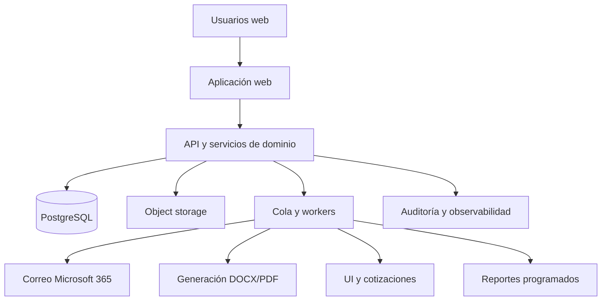
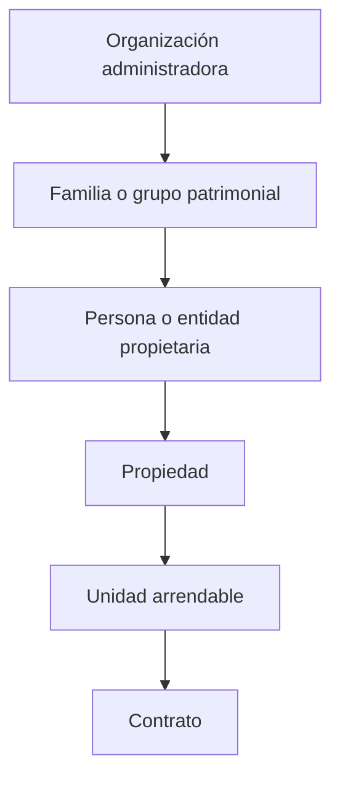

# MASTER SPECIFICATION — Sistema Web de Administración y Gestión Patrimonial Inmobiliaria

**Nombre de trabajo:** Farfalla Asset & Property Management  
**Versión del documento:** 1.0  
**Fecha:** 2026-08-01  
**Mercado inicial:** Uruguay  
**Escala inicial:** más de 40 inmuebles pertenecientes a varias personas, sociedades y grupos familiares  
**Destino:** documento maestro para iniciar y conducir el desarrollo con Claude Code  

---

## 0. Instrucciones obligatorias para Claude Code

Claude Code debe tratar este archivo como la **fuente funcional principal del proyecto**.

Antes de escribir código debe:

1. Leer el documento completo.
2. Crear un plan de implementación por entregables verificables.
3. Crear un registro de decisiones de arquitectura, denominado `docs/adr/`.
4. Identificar los requisitos marcados como `[OPEN]` y construir interfaces configurables o adaptadores, sin inventar formatos fiscales o integraciones no documentadas.
5. Implementar pruebas automáticas para todas las reglas monetarias, fiscales, contractuales y contables.
6. Evitar un desarrollo monolítico no estructurado. La solución será un **monolito modular**, con límites claros entre dominios.
7. No eliminar movimientos financieros ni históricos. Toda corrección deberá realizarse mediante reversión, nueva versión o contraasiento.
8. No utilizar `float` para dinero, porcentajes, unidades indexadas ni tipos de cambio.
9. No almacenar solamente el “estado actual” de propiedad, contrato, valor o exoneración. Toda información sensible a la fecha debe conservar historial de vigencia.
10. No implementar lógica fiscal uruguaya irreversible con valores codificados en el código. Las tasas, topes, conceptos, formatos y reglas deben ser parametrizables y versionadas.
11. Mantener compatibilidad con UYU, USD y UI desde la primera migración de base de datos.
12. Incluir auditoría de todas las altas, modificaciones, aprobaciones, anulaciones, cierres, reversiones, exportaciones y envíos.
13. Ejecutar `lint`, validación de tipos, pruebas unitarias, pruebas de integración y migraciones en cada entrega.
14. Utilizar las versiones estables vigentes de las dependencias en el momento de implementación; no fijar versiones obsoletas sugeridas por este documento.
15. Solicitar datos o muestras cuando una salida deba replicar exactamente un formato externo no contenido en este documento.

### Etiquetas utilizadas

- `[SGA]`: funcionalidad extraída del manual SGA aportado como referencia.
- `[PATRIMONIAL]`: funcionalidad adicional de gestión patrimonial y análisis de inversiones.
- `[TECH]`: decisión o requisito técnico.
- `[OPEN]`: requiere información externa, archivo de muestra, especificación oficial o decisión del responsable funcional.
- `[V1]`: obligatorio para la primera versión operativa.
- `[POST-V1]`: mejora posterior que no debe bloquear la salida inicial.

---

# 1. Visión del producto

Construir una aplicación web que combine:

1. **Administración integral de propiedades y alquileres en Uruguay**, replicando como mínimo el 100% de las funciones documentadas en el manual SGA.
2. **Gestión patrimonial inmobiliaria**, permitiendo medir valor, rentabilidad, riesgo, vacancia, apreciación, gastos y desempeño por inmueble, propietario, familia, entidad, zona y moneda.
3. **Automatización operativa**, incluyendo correos, documentos, contratos, recibos, liquidaciones, tareas, vencimientos y reportes.
4. **Trazabilidad financiera**, mediante un subledger de doble partida y cierres mensuales auditables.
5. **Consolidación multimoneda**, con reportes en pesos uruguayos, dólares estadounidenses y unidades indexadas.
6. **Base para inteligencia de mercado**, con históricos de valoración, comparables y estimaciones de renta y precio de venta.

La aplicación no debe ser solamente un sistema de cobranza. Debe convertirse en el sistema central para tomar decisiones sobre un patrimonio inmobiliario.

---

# 2. Objetivos medibles de la versión 1

La versión 1 se considerará operativa cuando permita:

- Cargar y administrar más de 40 inmuebles sin depender de planillas paralelas para la operación habitual.
- Reproducir todos los procesos documentados del sistema SGA.
- Mantener propietarios individuales, grupos de propietarios, sociedades y familias.
- Administrar propiedad compartida con porcentajes legales, económicos y fiscales distintos.
- Gestionar inquilinos, contratos, garantías, reajustes, cargos, pagos, recibos, mora y anulaciones.
- Gestionar ANDA, Contaduría General de la Nación y otras garantías mediante procesos separados e idempotentes.
- Registrar ingresos, gastos, CapEx, impuestos, comisiones y honorarios.
- Distribuir gastos generales mediante drivers configurables y auditables.
- Emitir liquidaciones de propietarios, facturas, resguardos y reportes fiscales cuando exista la especificación necesaria.
- Generar contratos y documentos desde plantillas.
- Enviar correos desde cuentas corporativas y registrar el historial de entrega.
- Producir reportes patrimoniales en UYU, USD y UI.
- Calcular rentabilidad bruta, rentabilidad neta, NOI, yield sobre costo, yield sobre valor de mercado, cash-on-cash y XIRR.
- Registrar valores de mercado y comparables por zona.
- Gestionar tareas, mantenimiento, proveedores y órdenes de trabajo.
- Mantener control de accesos y auditoría completa.

---

# 3. Principios de diseño no negociables

## 3.1 Historial efectivo por fecha

Las siguientes relaciones deben tener `valid_from` y `valid_to` o un mecanismo equivalente:

- Participación de propietarios.
- Distribución económica de rentas.
- Responsable del IRPF o IRNR.
- Exoneraciones fiscales.
- Contratos y adendas.
- Reglas de reajuste.
- Valores de mercado.
- Moneda funcional.
- Reglas de comisión.
- Drivers de gastos.
- Roles y autorizaciones especiales.

## 3.2 Dinero y unidades

Todo importe debe registrar:

- Importe original.
- Código de moneda o unidad original.
- Fecha económica.
- Fecha de contabilización.
- Fuente de cotización o índice.
- Tipo de cambio o valor de unidad utilizado cuando corresponda.
- Importe convertido únicamente como snapshot de reporte o contabilización, sin perder el valor original.

Usar `DECIMAL` o `NUMERIC`, con precisión suficiente. Valores sugeridos:

- Dinero: `NUMERIC(20, 6)`.
- Porcentajes: `NUMERIC(12, 8)`.
- Tipos de cambio e índices: `NUMERIC(20, 10)`.

## 3.3 Contabilidad inmutable

- Un asiento confirmado no puede editarse ni borrarse.
- Una anulación genera una reversión vinculada al documento original.
- Un recibo reimpreso conserva el mismo identificador y aumenta un contador de copias.
- Los períodos cerrados no admiten contabilizaciones sin reapertura autorizada.
- Las eliminaciones de datos maestros deben ser lógicas, salvo datos de prueba.

## 3.4 Separación entre operación y fiscalidad

La plataforma debe distinguir:

- Devengamiento del alquiler.
- Cobro del inquilino o agente de garantía.
- Acreditación al propietario.
- Retención fiscal.
- Comisión de administración.
- IVA u otros impuestos aplicables.
- Fondos disponibles para liquidación.
- Pago efectivo al propietario.

## 3.5 Configuración antes que código rígido

Deben parametrizarse:

- Tipos de documento.
- Conceptos de movimiento.
- Tasas fiscales.
- Tipos de garantía.
- Reglas de mora.
- Tipos de reajuste.
- Conceptos de comisión.
- Tipos de factura.
- Series y numeración.
- Plantillas de correo y documentos.
- Reglas de distribución.
- Fuentes de tipo de cambio e índices.

---

# 4. Arquitectura objetivo

## 4.1 Patrón general

`[TECH][V1]` Usar un **monolito modular** desplegado como aplicación web, con procesos en segundo plano.



## 4.2 Stack recomendado

- Frontend y backend web: Next.js con TypeScript.
- Base de datos: PostgreSQL.
- ORM: Prisma o Drizzle; elegir uno y documentar la decisión.
- Validación: Zod o equivalente.
- Autenticación corporativa: Microsoft Entra ID mediante OpenID Connect.
- Correo: Microsoft Graph.
- Archivos: object storage compatible con S3.
- Procesos diferidos: cola persistente y worker separado.
- Pruebas: framework unitario, integración con base de datos temporal y pruebas de navegador.
- Observabilidad: logs estructurados, tracking de errores y health checks.
- CI/CD: revisión automática de tipos, lint, tests, migraciones y build.

## 4.3 Estructura sugerida del repositorio

```text
/apps
  /web
  /worker
/packages
  /auth
  /database
  /domain
  /accounting
  /reporting
  /documents
  /email
  /integrations
  /ui
/docs
  PRD.md
  domain-model.md
  accounting-rules.md
  currency-and-indexation.md
  uruguay-tax-rules.md
  permissions.md
  reporting-definitions.md
  migration-from-sga.md
  test-scenarios.md
  /adr
CLAUDE.md
```

---

# 5. Modelo organizacional y de seguridad

## 5.1 Jerarquía patrimonial



Una organización puede administrar varios grupos familiares. Una entidad puede participar en varias propiedades. Una propiedad puede contener una o más unidades.

## 5.2 Roles mínimos

- **Administrador del sistema:** configuración completa, usuarios, integraciones y auditoría.
- **Director patrimonial:** acceso a indicadores, valuaciones, presupuestos, aprobaciones y reportes consolidados.
- **Gestor de propiedades:** contratos, inquilinos, comunicaciones, tareas y mantenimiento.
- **Tesorería/cobranzas:** cargos, pagos, conciliación, recibos y liquidaciones.
- **Contabilidad/fiscal:** asientos, cierres, impuestos, facturación, resguardos, BETA y SIGMA.
- **Operador:** carga limitada de datos y movimientos.
- **Consulta:** solo lectura.
- **Propietario externo:** portal limitado a sus inmuebles, documentos, liquidaciones y reportes.
- **Auditor:** lectura completa, exportación y acceso al historial, sin modificaciones.

## 5.3 Permisos por acción

Cada permiso debe contemplar:

- Ver.
- Crear.
- Modificar borradores.
- Confirmar.
- Aprobar.
- Revertir o anular.
- Reabrir períodos.
- Exportar.
- Enviar comunicaciones.
- Acceder a una familia, entidad, portafolio o propiedad específica.

## 5.4 Equivalencia con “Claves” de SGA

`[SGA][V1]` Debe poder crearse un usuario indicando nombre, credencial o identidad federada y tipo de acceso equivalente a:

- Supervisor.
- Operario.
- Usuario.

En la nueva plataforma esos tipos serán perfiles predefinidos sobre un modelo RBAC más granular. Cada usuario debe poder asociar una cuenta de correo autorizada.

---

# 6. Glosario de dominio

- **Organización:** empresa que administra las propiedades.
- **Familia o patrimonio:** agrupación económica o de reporting.
- **Entidad propietaria:** persona física, sociedad, fideicomiso u otra estructura jurídica.
- **Propietario SGA:** registro operativo que puede ser individual o grupo.
- **Grupo de propietarios:** agrupación utilizada para liquidar o definir tributación distinta por inmueble.
- **Propiedad:** activo inmobiliario identificado, normalmente por padrón y dirección.
- **Unidad:** espacio arrendable dentro de una propiedad.
- **Inquilino:** persona física o jurídica obligada por un contrato.
- **Garantía:** cobertura del contrato, incluyendo ANDA, CGN, aseguradora, depósito o garantía personal.
- **Contrato:** acuerdo de arrendamiento versionado.
- **Cargo:** obligación a cobrar, por ejemplo alquiler, consumo o mora.
- **Pago:** ingreso de fondos.
- **Aplicación de pago:** asignación de un pago a uno o varios cargos.
- **Recibo:** comprobante de una aplicación de pago.
- **Movimiento de propietario:** débito o crédito en el estado de cuenta del propietario.
- **Liquidación:** estado de cuenta y monto pagadero al propietario.
- **Gasto operativo:** costo del período para operar el inmueble.
- **CapEx:** inversión capitalizable o mejora significativa.
- **NOI:** ingreso operativo neto antes de financiamiento e impuestos del propietario.
- **Valoración:** estimación de valor del inmueble en una fecha.
- **Comparable:** observación de mercado utilizada para estimar renta o valor.

---

# 7. Modelo de datos mínimo

Esta sección describe entidades lógicas. Claude Code debe convertirla en un esquema relacional normalizado y documentado.

## 7.1 Organización, personas y contactos

### `organizations`

- `id`
- `name`
- `legal_name`
- `tax_id`
- `base_currency`
- `timezone`
- `status`

### `families`

- `id`
- `organization_id`
- `name`
- `reporting_currency`
- `notes`

### `parties`

Modelo unificado para personas y entidades.

- `id`
- `organization_id`
- `party_type`: person, company, trust, government_agency, other
- `display_name`
- `legal_name`
- `document_type`
- `document_number`
- `tax_residency`
- `is_legal_person`
- `birth_or_incorporation_date`
- `status`

### `party_contacts`

- Correos, teléfonos, direcciones, contacto preferido y vigencia.

### `bank_accounts`

- Titular.
- Banco.
- Moneda.
- Número o alias.
- Uso para cobros o pagos.
- Estado de verificación.

## 7.2 Propietarios y participaciones

### `owners`

- `party_id`
- `family_id`
- `legacy_sga_code`
- `settlement_type`: normal, group
- `default_tax_profile_id`
- `send_invoices_and_withholdings_automatically`
- `block_manual_movements`
- `payment_instructions`
- `status`

### `owner_groups`

- Grupo operativo y fiscal.
- Nombre.
- Vigencia.

### `owner_group_members`

- Miembro.
- Porcentaje o regla.
- Vigencia.

### `ownership_interests`

- `property_id` o `unit_id`.
- `owner_id`.
- `legal_percentage`.
- `economic_percentage`.
- `rent_distribution_percentage`.
- `tax_contribution_percentage`.
- `valid_from`.
- `valid_to`.

Los porcentajes pueden diferir. El sistema debe validar que cada dimensión aplicable totalice 100% en la fecha correspondiente.

## 7.3 Propiedades y unidades

### `properties`

- Código interno y código legado SGA.
- Nombre.
- Tipo.
- Padrón.
- Dirección normalizada.
- Calle, puerta, apartamento.
- Barrio, localidad, departamento y país.
- Geolocalización.
- Estado de ocupación.
- Año de construcción.
- Superficie de terreno.
- Superficie construida.
- Superficie arrendable.
- Moneda de referencia.
- Valor de adquisición.
- Fecha de adquisición.
- Gastos de adquisición.
- Estado del activo.

### `units`

- Propiedad.
- Código de unidad.
- Puerta/apartamento/local.
- Tipo.
- Dormitorios, baños, garajes.
- Superficie.
- Estado.
- Alquiler objetivo.
- Moneda de alquiler objetivo.

## 7.4 Inquilinos, garantes y garantías

### `tenants`

- `party_id`.
- Código legado.
- Referencia bancaria.
- Preferencia de comunicaciones.
- Estado.

### `guarantee_providers`

- ANDA.
- CGN/Contaduría.
- Aseguradora.
- Banco.
- Depósito.
- Garantía personal.
- Otros.

### `guarantees`

- Proveedor y tipo.
- Letra o número identificador.
- Importe máximo garantizado.
- Moneda.
- Fecha inicial y vencimiento.
- Agente identificó al arrendador: sí/no.
- Documentos.
- Estado.

## 7.5 Contratos

### `leases`

- Propiedad y unidad.
- Número de contrato.
- Fecha de firma.
- Inicio.
- Vencimiento.
- Extensión hasta.
- Destino: habitación, comercio u otro.
- Moneda.
- Alquiler inicial.
- Frecuencia.
- Día de vencimiento.
- Comisión sobre alquiler.
- Comisión sobre consumos.
- Reglas de mora.
- Estado.
- Versión.

### `lease_parties`

- Inquilinos.
- Garantes.
- Coarrendatarios.
- Rol.
- Responsabilidad solidaria o porcentaje.

### `lease_guarantee_allocations`

Permite un alquiler afianzado con dos o más garantías.

- Contrato.
- Garantía.
- Inquilino relacionado.
- Importe o porcentaje cubierto.
- Moneda.
- Vigencia.

## 7.6 Reajustes

### `adjustment_rules`

- Tipo: UI, IPC, UR, IMS, porcentaje fijo, tabla, fórmula personalizada.
- Fecha base.
- Frecuencia.
- Meses de diferimiento.
- Repetición anual.
- Fuente de índice.
- Regla de redondeo.

### `adjustment_schedule`

- Contrato.
- Fecha prevista.
- Regla.
- Estado.
- Valor anterior.
- Valor nuevo.
- Evidencia de cálculo.

## 7.7 Cargos, pagos y recibos

### `charges`

- Contrato.
- Tipo: alquiler, consumo, mora, ajuste, depósito, otro.
- Período.
- Fecha de vencimiento.
- Moneda.
- Importe original.
- Saldo.
- Estado.
- Orden/separador.
- Garantía asignada.
- Observaciones.

### `payments`

- Pagador.
- Fecha.
- Moneda.
- Importe.
- Canal.
- Referencia bancaria.
- Origen: inquilino, ANDA, CGN, otro.
- Estado.

### `payment_allocations`

- Pago.
- Cargo.
- Importe aplicado.
- Mora aplicada.
- Descuento.

### `receipts`

- Número.
- Pago.
- Fecha de emisión.
- Estado: emitido, anulado.
- Motivo de anulación.
- Recibo reversor.
- Cantidad de reimpresiones.
- PDF.

## 7.8 Subledger contable

### `ledger_accounts`

Plan de cuentas mínimo:

- Cuentas por cobrar a inquilinos.
- Caja y bancos.
- Ingresos por alquiler.
- Fondos de propietarios por pagar.
- Comisiones de administración.
- IVA débito/crédito.
- Retenciones IRPF/IRNR.
- Gastos por propiedad.
- CapEx.
- Mora del propietario.
- Mora de la administración.
- Saldos con agentes de garantía.

### `journal_entries`

- Fecha económica.
- Fecha contable.
- Período.
- Fuente.
- Documento fuente.
- Estado.
- Entrada reversada.
- Descripción.
- Usuario.

### `journal_lines`

- Cuenta.
- Débito.
- Crédito.
- Moneda original.
- Importe original.
- Dimensiones: familia, propietario, propiedad, unidad, contrato, inquilino, proveedor.

Toda entrada debe balancear por moneda funcional.

## 7.9 Gastos y distribución

### `expenses`

- Proveedor.
- Documento.
- Fecha.
- Vencimiento.
- Categoría.
- Clasificación: Opex, mantenimiento, reparación, CapEx, impuesto, seguro, honorario, financiero.
- Recuperable al inquilino: sí/no/parcial.
- Moneda e importe.
- Propiedad o centro de costo directo.
- Estado de aprobación y pago.

### `allocation_rules`

Drivers permitidos:

- Directo.
- Porcentaje de propiedad.
- Metros cuadrados.
- Cantidad de unidades.
- Valor de mercado.
- Alquiler facturado.
- Alquiler cobrado.
- Días ocupados.
- Cantidad de contratos.
- Porcentaje fijo.
- Fórmula personalizada aprobada.

### `allocation_runs` y `allocation_lines`

Cada ejecución debe conservar gasto original, regla, base, coeficientes, resultados, usuario y fecha.

## 7.10 Fiscalidad, comisiones y facturación

### `tax_profiles`

- Tipo: IRPF, IRNR, otro.
- Tasa.
- Vigencia.
- Residencia.
- Fuente o fundamento.

### `property_tax_exemptions`

- Propiedad.
- Tipo de exoneración.
- Porcentaje.
- Inicio.
- Vencimiento.
- Estado.
- Documento de respaldo.

### `commission_concepts`

- Código y nombre.
- Destino del pago: propietario o administración.
- Tipo aplicable: ambos, propietario, inquilino o vivienda.
- Descripción ampliada.
- Porcentaje.
- Importe mínimo.
- Importe máximo.
- Con IVA.
- Impuesto sobre comisión.
- Vigencia.

### `owner_commission_overrides`

- Propietario.
- Concepto.
- Descripción especial.
- Porcentaje.
- Mínimo.
- Máximo.
- Vigencia.

### `invoices` y `invoice_lines`

- Tipo de documento: factura, nota de crédito, nota de débito, resguardo, otro.
- Cliente.
- Inquilino opcional.
- Moneda.
- Descripción.
- Importe.
- Descuento.
- IVA.
- Total.
- Serie y número.
- Estado.
- Documento electrónico relacionado.

### `recurring_invoice_rules`

- Propietario/cliente.
- Concepto.
- Importe.
- Moneda.
- Frecuencia.
- Inicio y fin.
- Estado.

## 7.11 Gestión patrimonial

### `valuations`

- Propiedad.
- Fecha.
- Valor.
- Moneda.
- Fuente.
- Método.
- Tasador.
- Confianza.
- Observaciones.
- Archivo.

### `market_comparables`

- Venta o alquiler.
- Dirección y geolocalización.
- Zona.
- Fecha de publicación/captura.
- Precio y moneda.
- Precio por m².
- Superficie.
- Dormitorios, baños, garajes.
- Estado y antigüedad.
- Fuente y URL.
- Nivel de comparabilidad.

### `market_estimates`

- Propiedad.
- Fecha.
- Método.
- Valor mínimo, central y máximo.
- Renta mínima, central y máxima.
- Comparables usados.
- Ajustes.
- Confianza.

## 7.12 Tareas, mantenimiento y documentos

### `tasks`

- Título.
- Tipo.
- Prioridad.
- Responsable.
- Propiedad, unidad, contrato o persona vinculada.
- Fecha límite.
- Estado.
- Dependencias.

### `work_orders`

- Problema.
- Solicitante.
- Proveedor.
- Presupuesto.
- Aprobación.
- Costo final.
- Fotografías.
- Gasto vinculado.
- SLA.

### `documents`

- Entidad vinculada.
- Tipo.
- Nombre.
- Versión.
- Archivo.
- Hash.
- Fecha de vencimiento.
- Visibilidad.

### `document_templates`

- Tipo de documento.
- Plantilla DOCX/HTML.
- Variables disponibles.
- Versión.
- Estado.

## 7.13 Monedas e índices

### `currencies`

- UYU.
- USD.
- Otras monedas futuras.

### `index_units`

- UI.
- UR y otras si se incorporan.

### `exchange_rates`

- Fecha.
- Moneda base y cotizada.
- Tipo comprador, vendedor, promedio o interbancario.
- Valor.
- Fuente.
- Estado de verificación.

### `index_values`

- Unidad.
- Fecha.
- Valor en UYU.
- Fuente.

Las cotizaciones confirmadas no deben sobrescribirse. Las correcciones deben versionarse.

---

# 8. Requisitos funcionales detallados

## 8.1 Propietarios

### OWN-001 — Alta de propietario `[SGA][V1]`

Permitir registrar:

- Código automático y código legado.
- Nombre.
- Tipo y número de documento.
- Dirección, ciudad, código postal, teléfono y correo.
- Fecha de nacimiento o constitución.
- Tipo de liquidación: normal o grupo.
- Porcentaje y tipo de impuesto: IRPF o IRNR.
- Persona jurídica nacional: sí/no.
- Lugar o forma de pago.
- Envío automático de facturas y resguardos.
- Bloqueo de movimientos manuales.
- Observaciones.

### OWN-002 — Comisiones particulares `[SGA][V1]`

Configurar conceptos de comisión especiales por propietario con:

- Descripción ampliada.
- Porcentaje.
- Importe mínimo.
- Importe máximo.
- Vigencia.

### OWN-003 — Grupos de propietarios `[SGA][V1]`

Crear grupos que representen varios propietarios de una propiedad. El sistema moderno no debe requerir duplicar personas para representar tratamientos fiscales distintos, pero debe importar y reproducir el resultado económico del modelo SGA.

### OWN-004 — Participaciones históricas `[PATRIMONIAL][V1]`

Registrar porcentajes legales, económicos, de distribución y fiscales por fecha.

### OWN-005 — Estado de cuenta `[SGA][PATRIMONIAL][V1]`

Mostrar:

- Alquileres acreditados.
- Gastos.
- Comisiones.
- Impuestos.
- Facturas y resguardos.
- Liquidaciones.
- Saldo disponible.
- Movimientos pendientes de facturar.
- Marca equivalente a “F” para movimientos ya facturados.

## 8.2 Propiedades y unidades

### PROP-001 — Alta de vivienda o propiedad `[SGA][V1]`

Campos mínimos:

- Calle o edificio.
- Número de puerta.
- Apartamento.
- Barrio.
- Localidad.
- Sección judicial.
- Departamento.
- Código postal.
- Ocupada: sí/no.
- Número de padrón.
- Comodidades.
- Moneda del alquiler.
- Precio de alquiler.
- Garantía o datos informativos.
- Llaves.
- Observaciones.
- Propietarios y porcentajes.

### PROP-002 — Información patrimonial `[PATRIMONIAL][V1]`

Agregar datos de adquisición, superficie, clasificación, valor, deuda, seguro, estado físico, fotos, documentos y geolocalización.

### PROP-003 — Una propiedad con varias unidades `[PATRIMONIAL][V1]`

Distinguir propiedad de unidad arrendable.

## 8.3 Inquilinos y contratos

### TEN-001 — Alta de inquilino `[SGA][V1]`

Registrar nombre, documento, correo, teléfonos, referencia bancaria y observaciones.

### LEASE-001 — Contrato `[SGA][V1]`

Registrar:

- Fecha de inicio.
- Vencimiento.
- Extensión hasta.
- Destino.
- Propiedad/unidad.
- Moneda.
- Alquiler original.
- Sucursal o datos administrativos si aplica.
- Cobrar importe por recibo: sí/no.
- Conceptos adicionales.
- Carteles u otros datos operativos.
- Historial.
- Documentos.

### LEASE-002 — Garantía `[SGA][V1]`

Según el tipo de garantía se habilitarán campos específicos. Para ANDA o CGN se debe registrar si el agente identificó al arrendador. Si no lo identificó, la exportación fiscal deberá incluir los datos del propietario donde corresponda.

### LEASE-003 — Reajustes `[SGA][PATRIMONIAL][V1]`

Permitir calendarios de reajuste con:

- Fecha de reajuste.
- Meses de adelanto o diferimiento.
- Reajuste habilitado.
- Tabla o índice.
- Repetición anual.
- Procesos especiales.

### LEASE-004 — Comisión del contrato `[SGA][V1]`

Comisión porcentual o fija sobre alquiler, consumo o ambos.

### LEASE-005 — Mora `[SGA][V1]`

Configurar:

- Mora inmediata o con días de tolerancia.
- Porcentaje mensual.
- Destino: propietario o administración.
- Solicitar confirmación al cobrar fuera de fecha: sí/no.
- Cálculo trazable y reversible.

### LEASE-006 — Alquiler afianzado `[SGA][V1]`

Soportar una propiedad o unidad con múltiples coberturas de garantía. Cada garantía puede cubrir una parte del alquiler y generar cargos o cobros separados. Debe poder importarse el esquema legado en el que se duplicaban viviendas o inquilinos, pero el nuevo modelo no debe duplicar el activo.

## 8.4 Generación de alquileres

### RENT-001 — Generación por período desde contrato `[SGA][V1]`

Generar cargos entre fecha desde y fecha hasta, indicando:

- Extensión administrativa.
- Moneda.
- Nuevo alquiler.
- Opción de actualizar o preservar la fecha original del contrato.

La generación debe ser idempotente y mostrar un preview antes de confirmar.

### RENT-002 — Generación manual mensual `[SGA][V1]`

Crear una línea por alquiler con:

- Inquilino.
- Vencimiento.
- Mes y año.
- Orden/separador.
- Importe.

### RENT-003 — Copia de alquileres `[SGA][V1]`

Copiar cargos de un período al siguiente para un rango de inquilinos, con opción:

- Modificar si ya existe: sí/no.
- Emitir listado del procesamiento: sí/no.

El sistema debe informar creados, omitidos, reemplazados y errores.

### RENT-004 — Consulta de alquileres `[SGA][V1]`

Consultar por inquilino, vivienda, importe o período. Mostrar pendientes, pagados, vencidos, garantía, saldo, recibo y observaciones.

## 8.5 Cobros, recibos y anulaciones

### PAY-001 — Emisión de recibo `[SGA][V1]`

Seleccionar cargos pendientes, calcular mora según la regla, registrar pago y emitir recibo. Tras la aplicación completa, el cargo deja de aparecer en pendientes pero permanece en historial.

### PAY-002 — Historial de pagos `[SGA][V1]`

La UI debe permitir visualizar el equivalente conceptual de:

- Movimiento de alquiler.
- Movimiento de pago de saldo.

Internamente debe mantenerse un modelo normalizado de cargo, pago y aplicación.

### PAY-003 — Reimpresión `[SGA][V1]`

Reimprimir o descargar un duplicado del recibo sin crear un nuevo pago. Registrar usuario, fecha y número de copia.

### PAY-004 — Anulación de recibo `[SGA][V1]`

Anular indicando recibo, fecha de pago, período, separador, moneda e importe. La anulación debe crear reversión contable y devolver los cargos al estado pendiente cuando corresponda.

### PAY-005 — Pago parcial y pago a cuenta `[PATRIMONIAL][V1]`

Permitir pagos parciales, saldos a favor, aplicación posterior y reglas de prioridad.

## 8.6 ANDA, CGN y otras garantías

### GUAR-001 — Generación por garantía y moneda `[SGA][V1]`

Ejecutar un proceso por:

- Proveedor de garantía.
- Mes y año.
- Moneda.

Debe generar los alquileres esperados para acreditación.

### GUAR-002 — Control contra listado del agente `[SGA][V1]`

Permitir:

- Visualizar registros generados.
- Importar o cargar el listado recibido.
- Comparar esperado contra recibido.
- Marcar diferencias.
- Corregir antes de acreditar.

### GUAR-003 — Acreditación a propietarios `[SGA][V1]`

Luego de la validación, acreditar los pagos en las cuentas de propietarios. El proceso debe ser idempotente: una nueva ejecución procesa solamente faltantes.

### GUAR-004 — Estados del proceso `[V1]`

- Esperado.
- Ingresado.
- Controlado.
- Con diferencia.
- Acreditado.
- Reversado.

### GUAR-005 — Formatos externos `[OPEN]`

Se necesitan archivos de muestra o especificaciones de ANDA y CGN para automatizar importaciones y conciliaciones exactas. Hasta disponer de ellos, implementar carga manual y CSV configurable.

## 8.7 Movimientos de propietarios y viviendas

### MOV-001 — Movimiento directo al propietario `[SGA][V1]`

Registrar fecha, moneda, propietario, concepto, descripción, mes, año, debe/haber e importe.

### MOV-002 — Movimiento por vivienda `[SGA][V1]`

Registrar un lote de movimientos para una propiedad y distribuirlo entre propietarios según los porcentajes vigentes.

### MOV-003 — Lotes `[SGA][V1]`

- Crear lote.
- Agregar líneas.
- Validar.
- Confirmar/generar.
- Mostrar preview.
- Bloquear edición después de confirmar.
- Revertir mediante contra-lote.

### MOV-004 — Driver configurable `[PATRIMONIAL][V1]`

Además del porcentaje de propiedad, permitir todos los drivers definidos en la sección de gastos.

## 8.8 IRPF, IRNR y exoneraciones

### TAX-001 — Perfil fiscal del propietario `[SGA][V1]`

Tipo de impuesto, porcentaje y vigencia.

### TAX-002 — Exoneración por vivienda `[SGA][V1]`

Una misma persona puede tener propiedades gravadas y exoneradas. La exoneración se asigna a la propiedad con fechas y respaldo documental.

La nueva plataforma debe reproducir el resultado del mecanismo SGA de grupos y propietarios duplicados, pero modelarlo directamente sin duplicar la persona.

### TAX-003 — Aporte distinto del porcentaje de propiedad `[SGA][V1]`

Definir qué propietario o propietarios efectúan el aporte de IRPF/IRNR y en qué porcentaje, independientemente de la participación legal o económica.

### TAX-004 — Vencimientos de exoneraciones `[SGA][V1]`

Alertar con días configurables y poder limitar el control a viviendas ocupadas.

### TAX-005 — Parametrización `[V1]`

Las tasas y reglas deben ser configurables, versionadas y con pruebas. No asumir que una tasa histórica permanece vigente.

## 8.9 BETA y SIGMA

### DGI-001 — Generación por período `[SGA][V1]`

Permitir seleccionar período, ejecutar el proceso, visualizar el resultado y guardar los archivos generados.

### DGI-002 — Datos del arrendador no identificado `[SGA][V1]`

Cuando ANDA o CGN no identifique al arrendador, incluir los datos requeridos del propietario en la salida fiscal correspondiente.

### DGI-003 — Trazabilidad `[V1]`

Cada ejecución debe guardar:

- Período.
- Propietarios incluidos.
- Movimientos incluidos.
- Parámetros fiscales.
- Usuario.
- Fecha.
- Archivos.
- Hash.
- Estado: borrador, validado, presentado, reemplazado.

### DGI-004 — Formato exacto `[OPEN]`

El manual SGA no contiene el layout completo de BETA/SIGMA ni ejemplos de archivo. Para lograr paridad exacta se requiere:

- Archivo de ejemplo generado por SGA.
- Especificación oficial vigente.
- Validaciones de DGI.

Construir desde V1 el dominio, la pantalla, el cálculo, el almacenamiento y una interfaz de exportador. El exportador final debe activarse solamente luego de validar el formato con muestras reales.

## 8.10 Comisiones, resguardos y facturación

### COMM-001 — Conceptos de comisión `[SGA][V1]`

Campos exactos:

- Número/código.
- Nombre.
- Destino del pago: propietario o administración.
- Tipo: ambos, propietario, inquilino o vivienda.
- Descripción ampliada.
- Porcentaje.
- Importe mínimo.
- Importe máximo.
- Con IVA.
- Con impuesto a la comisión.

### COMM-002 — Overrides por propietario `[SGA][V1]`

Permitir porcentajes, mínimos, máximos y descripciones diferentes para un propietario.

### COMM-003 — Facturación de comisiones y resguardos `[SGA][V1]`

Seleccionar período y rango de propietarios, consultar documentos a facturar, revisar y generar. Marcar los movimientos como facturados.

### INV-001 — Facturación manual `[SGA][V1]`

Permitir:

- Concepto o tipo de documento.
- Cliente/propietario opcional.
- Descripción o artículo precargado.
- Inquilino asociado opcional.
- Moneda: UYU o USD y futuras.
- Importe.
- Porcentaje de descuento.
- IVA.
- Total.
- Confirmación.

### INV-002 — Facturación automática de honorarios fijos `[SGA][V1]`

Mantener reglas recurrentes por propietario. Generar masivamente por rango de propietarios y fecha.

### INV-003 — Notas de crédito y débito `[SGA][V1]`

Emitir documentos relacionados y contabilizar reversos o ajustes.

### INV-004 — Facturación electrónica `[OPEN]`

Se requiere definir proveedor, API, certificados y formato de CFE. La arquitectura debe usar un adaptador desacoplado y permitir comenzar con numeración interna y exportación controlada.

## 8.11 Correos, notificaciones y documentos

### EMAIL-001 — Cuenta por usuario `[SGA][V1]`

Cada operador debe tener una cuenta de correo configurada o autorizada mediante Microsoft 365.

### EMAIL-002 — Envío de recibos `[SGA][V1]`

Configurar:

- Habilitar envío.
- Consultar si se imprime.
- Consultar antes de enviar correo.
- Permitir agregar o modificar destinatarios en la confirmación.
- Envío automático al correo de la ficha.
- Asunto y cuerpo configurables.
- Salida: impresión, correo o ambas.

### EMAIL-003 — Envío de liquidaciones `[SGA][V1]`

Salida seleccionable:

- Impresión.
- Correo con PDF.
- Ambas.

### EMAIL-004 — Facturas y resguardos automáticos `[SGA][V1]`

Por propietario, activar o desactivar envío automático.

### EMAIL-005 — Historial de entrega `[PATRIMONIAL][V1]`

Registrar destinatarios, asunto, plantilla, adjuntos, usuario, fecha, estado, error y reintentos.

### EMAIL-006 — Automatizaciones `[PATRIMONIAL][V1]`

Eventos:

- Recordatorio previo al vencimiento.
- Aviso de deuda.
- Confirmación de pago.
- Reajuste próximo.
- Contrato próximo a vencer.
- Exoneración próxima a vencer.
- Solicitud de documentación.
- Estado de reparación.
- Liquidación mensual.
- Reporte patrimonial mensual.

### DOC-001 — Plantillas `[PATRIMONIAL][V1]`

Generar DOCX y PDF con variables, por ejemplo:

```text
{{owner.display_name}}
{{tenant.document_number}}
{{property.full_address}}
{{lease.rent_amount}}
{{lease.currency}}
{{lease.start_date}}
{{lease.end_date}}
```

Conservar versión de plantilla y documento generado.

## 8.12 Controles iniciales y alertas

### CTRL-001 — Controles de inicio `[SGA][V1]`

Al iniciar sesión o abrir el dashboard, generar controles configurables de:

- Vencimiento de exoneraciones.
- Vencimiento de contratos.
- Próximos inquilinos a reajustar.

Configurar días previos. Para exoneraciones, permitir considerar solamente viviendas ocupadas.

### CTRL-002 — Centro de alertas `[PATRIMONIAL][V1]`

Agregar:

- Alquileres vencidos.
- Pagos sin aplicar.
- Saldos a favor.
- Conciliaciones pendientes.
- Tareas vencidas.
- Documentos vencidos.
- Seguros próximos a vencer.
- Gastos fuera de presupuesto.
- Rentas por debajo de mercado.
- Propiedades con rendimiento inferior al objetivo.

## 8.13 Atajos equivalentes al sistema SGA

`[SGA][V1]` Implementar atajos web documentados y visibles en una ayuda contextual. Evitar interferir con atajos críticos del navegador.

Equivalencias solicitadas por el manual:

- `Ctrl + A`: consulta de alquileres/ficha del inquilino.
- `Ctrl + E`: ficha del propietario.
- `Ctrl + I`: consulta de inquilinos.
- `Ctrl + P`: consulta de propietarios.
- `Ctrl + F`: facturador.
- `Ctrl + V`: consulta inquilinos-vivienda.
- `Ctrl + N`: envío de notificaciones.
- `Ctrl + J`: movimientos de alquiler.
- `Ctrl + U`: movimientos de alquiler, según el manual.
- `F4`: crear nueva línea en grillas editables.
- `F3`: eliminar borrador cuando corresponda; nunca borrar movimientos confirmados.
- `F5`: búsqueda contextual.

`[OPEN]` El manual repite “movimientos de alquiler” para `Ctrl + J` y `Ctrl + U`. Confirmar la diferencia funcional con un usuario de SGA.

---

# 9. Gestión patrimonial y reporting

## 9.1 Dashboard general

Debe responder inmediatamente:

- Valor de mercado total.
- Costo histórico y capital invertido.
- Deuda.
- Equity.
- Alquiler mensual y anualizado.
- Ingresos cobrados y devengados.
- Gastos operativos.
- NOI.
- Rentabilidad bruta y neta.
- Vacancia física y económica.
- Morosidad.
- CapEx.
- Rentabilidad por familia, propietario, entidad, zona y tipo de inmueble.
- Contratos, reajustes y exoneraciones próximos.
- Propiedades con alquiler inferior al mercado.

## 9.2 Métricas y fórmulas

### Ingreso bruto potencial

```text
Alquiler contractual anualizado de todas las unidades, ocupadas o vacantes.
```

### Ingreso efectivo

```text
Ingreso bruto potencial
- pérdida por vacancia
- incobrables
- bonificaciones
+ otros ingresos operativos
```

### NOI

```text
Ingreso efectivo
- gastos operativos atribuibles al inmueble
```

No incluir deuda, impuesto personal del propietario ni depreciaciones, salvo reporte alternativo explícito.

### Yield bruto sobre valor de mercado

```text
alquiler anualizado / valor de mercado actual
```

### Yield neto sobre valor de mercado

```text
NOI anualizado / valor de mercado actual
```

### Yield sobre costo

```text
NOI anualizado / capital invertido acumulado
```

### Cash-on-cash

```text
flujo de caja anual después de deuda / capital propio aportado
```

### Retorno total

```text
flujo neto del período
+ variación de valor
- CapEx no incluido en el flujo operativo
```

### XIRR

Usar todos los flujos fechados:

- Compra.
- Gastos de adquisición.
- Aportes.
- Ingresos netos.
- CapEx.
- Deuda si corresponde al enfoque elegido.
- Valor terminal o venta.

La UI debe explicar el alcance de cada cálculo y evitar mezclar retornos apalancados y no apalancados.

## 9.3 Dimensiones de análisis

- Organización.
- Familia.
- Entidad.
- Propietario.
- Portafolio.
- Propiedad.
- Unidad.
- Barrio.
- Zona.
- Departamento.
- Tipo de inmueble.
- Moneda.
- Garantía.
- Administrador responsable.
- Ocupada/vacante.
- Año de adquisición.

## 9.4 Reportes obligatorios

- Estado patrimonial consolidado.
- P&L por inmueble y consolidado.
- Flujo de caja por criterio caja.
- Resultado por criterio devengado.
- Rent roll.
- Antigüedad de saldos.
- Morosidad.
- Liquidación de propietarios.
- Presupuesto versus real.
- Gastos por categoría y por m².
- CapEx histórico y previsto.
- Evolución del valor.
- Ocupación y costo de vacancia.
- Contratos a vencer.
- Reajustes futuros.
- Exoneraciones y obligaciones fiscales.
- Comparación de alquiler contractual contra mercado.
- Rentabilidad por zona.
- Reporte ejecutivo mensual en PDF y Excel.

## 9.5 Reporting multimoneda

Cada reporte debe permitir elegir:

- Moneda original.
- UYU.
- USD.
- UI.

Políticas de conversión configurables:

- Tipo de cambio de transacción.
- Tipo de cambio de cierre.
- Promedio mensual.
- Tipo comprador, vendedor o interbancario.
- Valor de UI de la fecha, cierre o promedio.

Mostrar siempre la política elegida.

---

# 10. Valoraciones y estimación de mercado

## 10.1 Etapa V1 — Valuaciones manuales estructuradas

Registrar valor, fecha, moneda, fuente, tasador, método, confianza, comentarios y respaldo.

## 10.2 Comparables

Cargar comparables de venta y alquiler. Calcular:

- Mediana de precio por m².
- Rango intercuartílico.
- Distancia geográfica.
- Antigüedad del comparable.
- Ajustes por superficie, garaje, terraza, estado, antigüedad y amenities.
- Rango de valor y alquiler.

## 10.3 Estimación automática inicial

Usar comparables ponderados, no una cifra única opaca. Entregar:

- Mínimo.
- Valor central.
- Máximo.
- Confianza.
- Comparables principales.
- Ajustes aplicados.

## 10.4 Modelos posteriores `[POST-V1]`

- Regresión hedónica.
- Gradient boosting.
- Series por barrio.
- Capitalización de NOI.
- Alertas automáticas de desviación.

Nunca presentar una estimación automática como tasación oficial.

---

# 11. Tareas, mantenimiento y proveedores

## 11.1 Tareas

- Título y descripción.
- Tipo.
- Prioridad.
- Responsable.
- Fecha límite.
- Propiedad, unidad, contrato, propietario o inquilino.
- Checklist.
- Archivos.
- Comentarios.
- Estado.
- Historial.

## 11.2 Órdenes de trabajo

Flujo:

```text
Solicitud -> diagnóstico -> presupuesto -> aprobación -> ejecución -> control -> cierre -> gasto
```

Debe admitir:

- Uno o varios presupuestos.
- Aprobación del propietario.
- Proveedor asignado.
- Costo estimado y real.
- Fotografías antes/después.
- Recuperación al inquilino.
- Clasificación Opex/CapEx.
- SLA.

## 11.3 Proveedores

- Datos legales y de contacto.
- Rubro.
- Documentación.
- Cuenta bancaria.
- Evaluación.
- Historial de trabajos.
- Seguros y vencimientos.

---

# 12. Conciliación bancaria y tesorería

## 12.1 Importación

Permitir CSV configurable y, posteriormente, integraciones bancarias.

## 12.2 Matching

Sugerir coincidencias por:

- Importe.
- Moneda.
- Fecha.
- Referencia.
- Inquilino.
- Propiedad.
- Patrón histórico.

Toda sugerencia requiere confirmación salvo reglas explícitamente autorizadas.

## 12.3 Saldos

- Pagos sin aplicar.
- Saldos a favor.
- Transferencias entre cuentas.
- Fondos por liquidar.
- Comisiones pendientes.
- Diferencias de cambio.

---

# 13. API y servicios de dominio

No exponer lógica crítica solamente en la interfaz. Crear servicios de dominio y endpoints protegidos.

## 13.1 Endpoints conceptuales

```text
/api/owners
/api/owner-groups
/api/properties
/api/units
/api/tenants
/api/leases
/api/leases/:id/adjustments
/api/rent-runs
/api/charges
/api/payments
/api/receipts
/api/receipts/:id/reverse
/api/guarantee-runs
/api/owner-movements
/api/allocation-runs
/api/tax-profiles
/api/exemptions
/api/commissions
/api/invoices
/api/recurring-invoices
/api/dgi/beta-sigma-runs
/api/expenses
/api/valuations
/api/comparables
/api/tasks
/api/work-orders
/api/documents
/api/reports
/api/notifications
/api/imports
/api/audit
```

## 13.2 Comandos de dominio críticos

- `CreateLease`.
- `GenerateRentCharges`.
- `CopyRentCharges`.
- `ApplyRentAdjustment`.
- `RegisterPayment`.
- `AllocatePayment`.
- `IssueReceipt`.
- `ReverseReceipt`.
- `RunGuaranteeSettlement`.
- `CreditOwnersFromGuaranteeRun`.
- `PostOwnerMovementBatch`.
- `AllocateExpense`.
- `CloseAccountingPeriod`.
- `ReopenAccountingPeriod`.
- `GenerateOwnerStatement`.
- `GenerateCommissionInvoices`.
- `GenerateRecurringInvoices`.
- `GenerateBetaSigmaRun`.
- `SendDocumentEmail`.

Cada comando debe validar autorización, estado, período, moneda, duplicados e idempotencia.

---

# 14. Pantallas y navegación

## 14.1 Dashboard

- KPIs.
- Alertas.
- Cobranzas pendientes.
- Tareas.
- Próximos vencimientos.
- Gráficos de rentabilidad.

## 14.2 Fichas maestras

- Propietario.
- Grupo/familia.
- Propiedad.
- Unidad.
- Inquilino.
- Contrato.
- Garantía.
- Proveedor.

Cada ficha debe tener pestañas:

- Resumen.
- Datos.
- Finanzas.
- Documentos.
- Tareas.
- Comunicaciones.
- Historial y auditoría.

## 14.3 Operaciones

- Generación de alquileres.
- Cargos pendientes.
- Cobro y recibos.
- ANDA/CGN.
- Movimientos de propietario.
- Lotes de distribución.
- Facturación.
- Liquidaciones.
- Cierre mensual.

## 14.4 Patrimonio

- Valoraciones.
- Comparables.
- Rentabilidad.
- Presupuesto.
- Escenarios.
- Reportes.

## 14.5 Administración

- Usuarios y roles.
- Parámetros.
- Conceptos.
- Monedas e índices.
- Plantillas.
- Integraciones.
- Auditoría.
- Importaciones.

---

# 15. Procesos en segundo plano

Crear jobs persistentes, reintentables e idempotentes para:

- Generación mensual de cargos.
- Reajustes programados.
- Actualización de UI.
- Actualización de tipos de cambio.
- Envío de recordatorios.
- Generación de PDF/DOCX.
- Envío de recibos y liquidaciones.
- Reporte mensual.
- Control de vencimientos.
- Importación bancaria.
- Conciliación sugerida.
- Ejecución de facturas recurrentes.
- Backups y verificaciones.

Cada job debe registrar inicio, fin, parámetros, resultado, errores, reintentos y usuario o regla que lo originó.

---

# 16. Migración desde SGA y planillas

## 16.1 Principios

- No migrar directamente a producción sin staging.
- Conservar códigos legados.
- Ejecutar conciliación de saldos.
- Importar históricos suficientes para reportes.
- Mantener evidencia de cada lote importado.

## 16.2 Orden recomendado

1. Propietarios.
2. Grupos.
3. Propiedades y viviendas.
4. Participaciones.
5. Inquilinos.
6. Garantías.
7. Contratos y reajustes.
8. Cargos pendientes.
9. Pagos y recibos históricos.
10. Estados de cuenta de propietarios.
11. Movimientos y comisiones.
12. Exoneraciones y perfiles fiscales.
13. Documentos.
14. Valores, gastos y datos patrimoniales desde planillas.

## 16.3 Controles de migración

- Conteo de registros.
- Total de saldos por moneda.
- Total de cargos pendientes.
- Total de propietarios y propiedades.
- Participaciones que suman 100%.
- Contratos activos.
- Recibos y anulaciones.
- Movimientos facturados.
- Exoneraciones vigentes.

## 16.4 Exportaciones requeridas `[OPEN]`

Solicitar al proveedor SGA:

- Esquema de base de datos o exportación CSV/Excel.
- Plan de conceptos.
- Propietarios.
- Viviendas.
- Inquilinos.
- Contratos.
- Alquileres.
- Pagos.
- Movimientos.
- Facturas y resguardos.
- BETA/SIGMA.
- Usuarios si procede.

---

# 17. Reglas de auditoría

Registrar en `audit_log`:

- Usuario.
- Fecha y hora.
- IP y sesión.
- Entidad.
- Acción.
- Estado anterior y nuevo, con protección de datos sensibles.
- Motivo obligatorio para anulación, reversión, reapertura y modificación fiscal.
- Correlation ID de operación.

Eventos que requieren auditoría reforzada:

- Cambio de participación.
- Cambio de cuenta bancaria.
- Cambio de tasa fiscal.
- Exoneración.
- Cambio de contrato.
- Reajuste.
- Pago.
- Recibo.
- Anulación.
- Factura.
- Liquidación.
- Cierre/reapertura.
- Exportación fiscal.
- Cambio de permisos.

---

# 18. Requisitos no funcionales

## 18.1 Seguridad

- SSO y MFA mediante proveedor corporativo.
- Autorización del lado servidor.
- Cifrado en tránsito y reposo.
- Gestión segura de secretos.
- URLs temporales para documentos.
- Separación por organización y familia.
- Protección contra acceso directo por ID.
- Rate limiting en endpoints sensibles.

## 18.2 Disponibilidad y recuperación

- Backups diarios.
- Recuperación a un punto en el tiempo cuando la infraestructura lo permita.
- Prueba periódica de restauración.
- Ambientes separados: desarrollo, staging y producción.
- Health checks.

## 18.3 Rendimiento

Con la escala inicial, las pantallas habituales deben responder en menos de dos segundos bajo condiciones normales. Los reportes pesados deben ejecutarse en segundo plano y notificar al usuario.

## 18.4 Accesibilidad y usabilidad

- Diseño responsive, con prioridad desktop.
- Navegación por teclado.
- Tablas con filtros, columnas configurables y exportación.
- Confirmaciones explícitas para acciones irreversibles.
- Mensajes de error comprensibles.
- No replicar la interfaz de escritorio antigua de SGA; conservar la lógica, no sus limitaciones.

## 18.5 Localización

- Español de Uruguay como idioma inicial.
- Fechas `dd/mm/yyyy` en UI.
- Zona horaria `America/Montevideo`.
- Separadores numéricos configurables.

---

# 19. Pruebas obligatorias

## 19.1 Pruebas unitarias

- Comisiones con mínimo y máximo.
- Mora con y sin tolerancia.
- Reajustes.
- Conversión UYU/USD/UI.
- Distribución por porcentajes.
- IRPF distinto del porcentaje de propiedad.
- Exoneración por inmueble.
- Pagos parciales.
- Reversión de recibo.
- Idempotencia de generación de alquileres.
- Idempotencia de ANDA/CGN.
- XIRR.
- NOI y yields.

## 19.2 Pruebas de integración

- Crear propietario, propiedad, contrato, cargos, pago y liquidación.
- Contrato afianzado con dos garantías.
- Lote de gastos distribuido a varios propietarios.
- Facturación de comisión y resguardo.
- Facturación recurrente.
- Cierre y reapertura.
- Correo con PDF.
- Importación y conciliación bancaria.

## 19.3 Pruebas end-to-end

### Escenario E2E-001 — Alquiler normal

1. Crear propietario.
2. Crear propiedad.
3. Asignar 100%.
4. Crear inquilino.
5. Crear contrato.
6. Generar 12 alquileres.
7. Cobrar uno.
8. Emitir recibo.
9. Reimprimir.
10. Anular.
11. Verificar saldo y auditoría.

### Escenario E2E-002 — Propiedad compartida

1. Dos propietarios 60/40.
2. Contribución fiscal 100/0.
3. Registrar alquiler.
4. Registrar gasto.
5. Liquidar.
6. Validar distribución económica y fiscal.

### Escenario E2E-003 — Exoneración

1. Mismo propietario con dos propiedades.
2. Una gravada y otra exonerada.
3. Cobrar ambos alquileres.
4. Verificar retención solamente en la gravada.

### Escenario E2E-004 — ANDA/CGN

1. Generar esperado por garantía y moneda.
2. Importar listado con diferencia.
3. Resolver diferencia.
4. Acreditar.
5. Reejecutar y comprobar que no duplica.

### Escenario E2E-005 — Patrimonial

1. Cargar compra, gastos y valor de mercado.
2. Registrar 12 meses de ingresos y gastos.
3. Calcular NOI, yields, cash-on-cash y XIRR.
4. Cambiar moneda de reporte.
5. Validar consistencia.

---

# 20. Matriz de paridad funcional con el manual SGA

Todos los elementos son obligatorios para declarar paridad.

| Sección del manual | Requisito en esta especificación | Estado esperado V1 |
|---|---|---|
| Ingreso de propietarios | OWN-001, OWN-002 | Completo |
| Ingreso de viviendas | PROP-001 | Completo |
| Ingreso de inquilinos | TEN-001, LEASE-001 a 005 | Completo |
| Generar alquileres | RENT-001 a 004 | Completo |
| Alquileres afianzados | LEASE-006 | Completo |
| Emitir recibos | PAY-001, PAY-002 | Completo |
| Reimprimir recibos | PAY-003 | Completo |
| Anular recibos | PAY-004 | Completo |
| ANDA y Contaduría | GUAR-001 a 005 | Completo, con CSV/manual hasta recibir formato exacto |
| Movimientos de propietarios | MOV-001 | Completo |
| Movimientos de viviendas | MOV-002, MOV-003 | Completo |
| Grupos de propietarios | OWN-003 | Completo |
| Exoneraciones por vivienda | TAX-002 | Completo |
| Aporte IRPF diferente | TAX-003 | Completo |
| Accesos directos | sección 8.13 | Completo |
| BETA y SIGMA | DGI-001 a 004 | Dominio completo; exportador exacto sujeto a muestra oficial |
| Facturar comisiones y resguardos | COMM-003 | Completo |
| Facturación manual | INV-001, INV-003 | Completo |
| Facturación automática | INV-002 | Completo |
| Conceptos para comisiones | COMM-001, COMM-002 | Completo |
| Claves | sección 5 | Completo mediante RBAC/SSO |
| Funciones de correo | EMAIL-001 a 006 | Completo |
| Recibo de alquileres por correo | EMAIL-002 | Completo |
| Envío de liquidaciones | EMAIL-003 | Completo |
| Controles iniciales | CTRL-001 | Completo |

---

# 21. Plan de implementación de la versión 1

La versión 1 incluye todo el alcance, pero debe construirse en hitos internos.

## Hito 0 — Descubrimiento y prototipo

- Confirmar decisiones `[OPEN]`.
- Diseñar modelo de datos.
- Crear wireframes.
- Preparar datos de muestra.
- Definir plan contable.
- Definir política de monedas.

## Hito 1 — Fundación

- Repositorio.
- CI/CD.
- Autenticación.
- Organización, familias y roles.
- Base de datos y auditoría.
- Archivos.
- Parámetros.

## Hito 2 — Maestros y contratos

- Propietarios.
- Grupos.
- Propiedades/unidades.
- Participaciones.
- Inquilinos.
- Garantías.
- Contratos.
- Reajustes.
- Documentos.

## Hito 3 — Operación SGA

- Generación y copia de alquileres.
- Consulta de cargos.
- Pagos.
- Recibos.
- Reimpresión.
- Anulación.
- Mora.
- ANDA/CGN.
- Movimientos por propietario y vivienda.

## Hito 4 — Fiscal y facturación

- IRPF/IRNR.
- Exoneraciones.
- Contribución fiscal distinta.
- Comisiones.
- Resguardos.
- Facturación manual y recurrente.
- Marco BETA/SIGMA.

## Hito 5 — Gestión patrimonial

- Gastos y drivers.
- Valoraciones.
- Comparables.
- KPIs.
- Reportes.
- UI y USD.
- Presupuesto versus real.

## Hito 6 — Automatización

- Microsoft 365.
- Correos.
- Plantillas.
- Tareas.
- Mantenimiento.
- Alertas.
- Reportes programados.

## Hito 7 — Migración y paralelismo

- Importar SGA.
- Conciliar.
- Ejecutar al menos dos cierres mensuales en paralelo.
- Resolver diferencias.
- Aprobar cutover.

---

# 22. Datos demo obligatorios

Crear un seed reproducible con:

- Organización “Farfalla Props Demo”.
- Dos familias.
- Cuatro propietarios, incluyendo una sociedad.
- Un grupo de propietarios.
- Seis propiedades en dos barrios.
- Ocho unidades.
- Contratos en UYU, USD y UI.
- Una propiedad exonerada.
- Una propiedad con IRPF aportado por un propietario distinto a su porcentaje legal.
- Un contrato ANDA.
- Un contrato CGN.
- Un contrato con garantía personal.
- Un alquiler afianzado con dos garantías.
- Cargos pendientes y pagos históricos.
- Un recibo anulado.
- Gastos directos y generales.
- Un driver por m² y otro por valor de mercado.
- Dos valuaciones por propiedad.
- Comparables.
- Tareas y órdenes de trabajo.
- Facturas, comisiones y resguardos.

---

# 23. Definition of Done

Una funcionalidad está terminada solamente cuando:

- Cumple criterios de aceptación.
- Tiene pruebas automáticas.
- Respeta permisos.
- Genera auditoría.
- Maneja errores y estados vacíos.
- Funciona en UYU, USD y UI si involucra importes.
- Es idempotente cuando corresponde.
- Tiene documentación funcional breve.
- Tiene migración de base de datos.
- No rompe conciliaciones contables.
- Pasó validación en staging.

La versión 1 está terminada cuando además:

- Se completó la matriz de paridad SGA.
- Se conciliaron saldos migrados.
- Se ejecutaron dos cierres mensuales paralelos.
- Se validaron recibos, liquidaciones, facturas y resguardos.
- Se validó el reporting patrimonial.
- Se probó restauración de backup.
- Se aprobó seguridad y permisos.

---

# 24. Decisiones que no deben inventarse

Claude Code debe detenerse y pedir información concreta para:

1. Layout oficial y muestras BETA/SIGMA.
2. Integración exacta de facturación electrónica/CFE.
3. Archivos o APIs de ANDA y CGN.
4. Fuente y política exacta de tipo de cambio.
5. Fuente y frecuencia de actualización de UI.
6. Plantillas legales definitivas de contratos y adendas.
7. Plan contable final.
8. Datos de migración y esquema exportado desde SGA.
9. Reglas fiscales no contenidas en el manual.
10. Diferencia exacta entre los atajos `Ctrl + J` y `Ctrl + U`.

Mientras esos elementos estén pendientes, debe implementar interfaces, configuraciones, mocks y validaciones manuales que permitan completar el resto del producto.

---

# 25. Primer plan de trabajo para Claude Code

Al recibir este archivo, ejecutar el siguiente proceso:

## Paso 1 — Preparación

- Crear `CLAUDE.md` con las reglas no negociables de la sección 0.
- Crear `docs/implementation-plan.md`.
- Crear issues o tareas por hito y requisito.
- Crear `docs/open-decisions.md` con todos los `[OPEN]`.

## Paso 2 — Arquitectura

- Proponer ADR para ORM, autenticación, storage, cola y generación documental.
- Diseñar diagrama ER.
- Diseñar plan contable inicial.
- Diseñar estrategia multitenant y RLS/autorización.

## Paso 3 — Bootstrap

- Inicializar proyecto.
- Configurar PostgreSQL.
- Configurar migraciones.
- Configurar testing.
- Configurar CI.
- Crear seed demo.

## Paso 4 — Vertical slice inicial

Implementar un flujo completo y pequeño:

```text
Propietario -> propiedad -> unidad -> inquilino -> contrato -> cargo -> pago -> recibo -> estado de cuenta
```

Debe incluir permisos, auditoría y pruebas antes de ampliar módulos.

## Paso 5 — Paridad SGA

Seguir la matriz de la sección 20, sin marcar un ítem completo hasta superar sus pruebas E2E.

## Paso 6 — Gestión patrimonial

Agregar gastos, drivers, valuaciones, FX/UI y reporting sobre el mismo modelo contable.

---

# 26. Prompt de arranque sugerido para Claude Code

Copiar este documento en la raíz del repositorio y utilizar un mensaje equivalente al siguiente:

```text
Lee por completo PROPERTY_ASSET_MANAGEMENT_MASTER_SPEC.md.
No escribas código todavía.

1. Resume la arquitectura y los dominios.
2. Identifica contradicciones, riesgos y decisiones OPEN.
3. Propón el modelo de datos inicial y un diagrama ER.
4. Propón un plan de implementación en hitos con criterios de aceptación.
5. Crea CLAUDE.md, docs/implementation-plan.md, docs/open-decisions.md y los ADR iniciales.
6. Recién después de que el plan sea aprobado, implementa el bootstrap y el primer vertical slice.

Respeta especialmente:
- dinero sin float;
- historial por vigencia;
- ledger inmutable;
- auditoría;
- UYU, USD y UI;
- paridad completa con SGA;
- no inventar formatos fiscales ni integraciones externas.
```

---

# 27. Origen y alcance de la extracción SGA

La funcionalidad `[SGA]` de este documento se basa en el manual inicial aportado, de 25 páginas. El manual documenta:

- Propietarios.
- Viviendas.
- Inquilinos.
- Garantías.
- Reajustes.
- Generación y copia de alquileres.
- Alquileres afianzados.
- Emisión, reimpresión y anulación de recibos.
- Procesamiento de ANDA y Contaduría.
- Movimientos de propietarios y viviendas.
- Grupos de propietarios.
- Exoneraciones.
- Distribución de IRPF distinta de la propiedad.
- Atajos.
- BETA/SIGMA.
- Comisiones y resguardos.
- Facturación manual y automática.
- Conceptos de comisión.
- Usuarios y claves.
- Envío por correo de recibos y liquidaciones.
- Controles de vencimientos.

El manual no contiene la estructura técnica de la base de datos, el layout completo de archivos fiscales, las APIs de terceros ni las reglas actuales completas de DGI. Esos elementos están expresamente marcados como `[OPEN]`.

---

# 28. Resultado esperado

El producto final debe permitir que un gestor opere la cartera diaria y que un director patrimonial analice la calidad económica de cada activo desde el mismo sistema.

La aplicación debe reemplazar simultáneamente:

- La operativa administrativa de SGA.
- Las planillas de gastos y rentabilidad.
- Los recordatorios manuales.
- La generación manual de contratos y comunicaciones.
- Los reportes patrimoniales dispersos.

El criterio central no es replicar una interfaz antigua, sino conservar todas sus reglas útiles, modelarlas correctamente y agregar una capa patrimonial, contable, documental y analítica moderna.
