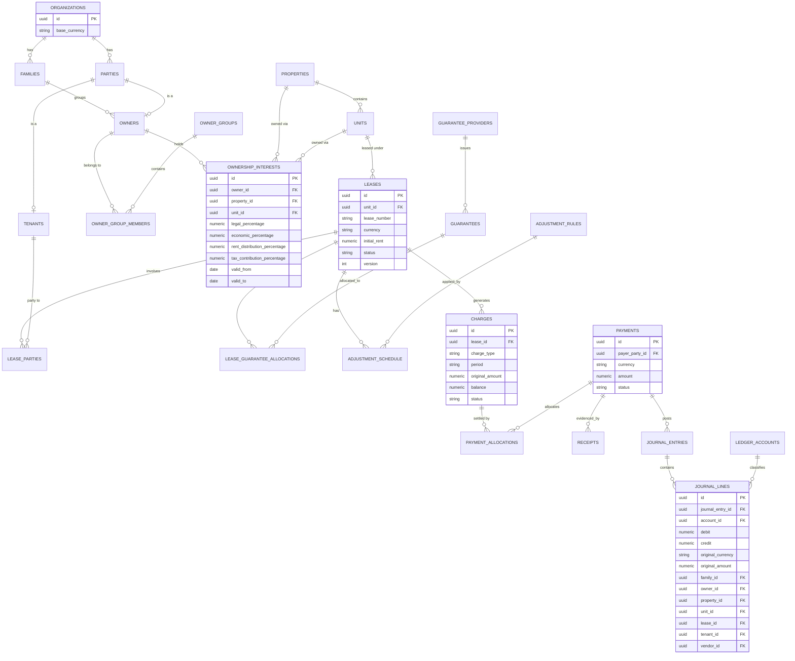
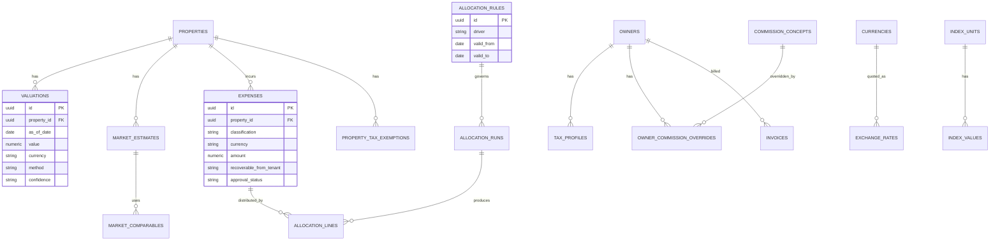

# Modelo de datos y diagrama ER (inicial)

Deriva de la sección 7 del spec. Este documento describe las entidades
lógicas ya normalizadas en tablas relacionales, agrupadas por dominio
(paquete). El detalle campo a campo completo está en la sección 7 del
spec; aquí se documentan las relaciones, claves y decisiones de
normalización que el spec deja implícitas.

Convenciones aplicadas a **todas** las tablas salvo que se indique lo
contrario (ver `CLAUDE.md` y ADR 0006):

- `id UUID` (v7) como clave primaria.
- `organization_id UUID` (FK a `organizations`) + policy RLS.
- `created_at`, `created_by`, `updated_at`, `updated_by`.
- Baja lógica: `status` o `deleted_at`, nunca `DELETE` físico salvo datos
  de prueba.
- Tablas de relación sensibles (participaciones, roles, tasas, drivers,
  reglas de comisión/mora/reajuste, moneda funcional) llevan
  `valid_from DATE NOT NULL` y `valid_to DATE NULL` (abierto = vigente).

## 7.x → paquete de dominio

| Paquete | Tablas principales |
|---|---|
| `organizations` | `organizations`, `families`, `parties`, `party_contacts`, `bank_accounts`, `users`, `roles`, `permissions`, `role_permissions`, `user_scopes`, `audit_log` |
| `owners` | `owners`, `owner_groups`, `owner_group_members`, `ownership_interests`, `tax_profiles`, `property_tax_exemptions` |
| `properties` | `properties`, `units` |
| `tenants` | `tenants`, `guarantee_providers`, `guarantees` |
| `leases` | `leases`, `lease_parties`, `lease_guarantee_allocations`, `adjustment_rules`, `adjustment_schedule` |
| `billing` | `charges`, `payments`, `payment_allocations`, `receipts` |
| `accounting` | `ledger_accounts`, `journal_entries`, `journal_lines`, `accounting_periods` |
| `expenses` | `expenses`, `allocation_rules`, `allocation_runs`, `allocation_lines` |
| `commissions_billing` | `commission_concepts`, `owner_commission_overrides`, `invoices`, `invoice_lines`, `recurring_invoice_rules` |
| `patrimonial` | `valuations`, `market_comparables`, `market_estimates` |
| `operations` | `tasks`, `work_orders`, `vendors` |
| `documents` | `documents`, `document_templates`, `email_deliveries` |
| `market_data` | `currencies`, `index_units`, `exchange_rates`, `index_values` |
| `jobs` | `job_runs` (ver ADR 0004) |

## Diagrama ER — núcleo operativo (SGA)

## Diagrama ER — capa patrimonial

## Notas de normalización sobre el spec

- **`owners` vs `parties`**: `owners`, `tenants` y proveedores son roles
  sobre una `party` (persona o entidad), no entidades separadas — evita
  duplicar personas que son propietario y garante a la vez, y resuelve de
  forma directa OWN-003 y TAX-002 (el spec pide expresamente no duplicar
  la persona para representar tratamientos fiscales distintos).
- **`ownership_interests` con cuatro porcentajes independientes**
  (legal, económico, de distribución de renta, de aporte fiscal) es la
  pieza central que reemplaza el mecanismo de "propietarios duplicados"
  de SGA (sección 7.2, "Los porcentajes pueden diferir").
- **`charges` → `payment_allocations` → `receipts`** separa devengamiento,
  cobro y comprobante en tres tablas, cumpliendo la regla no negociable de
  sección 3.4 (separación operación/fiscalidad) y permitiendo pagos
  parciales (PAY-005) sin ambigüedad.
- **`journal_lines` con dimensiones explícitas** (familia, propietario,
  propiedad, unidad, contrato, inquilino, proveedor) es lo que permite
  construir todo el reporting patrimonial (sección 9) sobre el mismo
  ledger contable, en vez de mantener un modelo de reporting paralelo.
- Todas las tablas de tasas/reglas (`tax_profiles`,
  `commission_concepts`, `owner_commission_overrides`,
  `allocation_rules`, `adjustment_rules`) son parametrizables y
  versionadas por vigencia — nunca constantes en código (regla no
  negociable 6/10 de `CLAUDE.md`).

## Pendiente para el ADR de plan contable

El plan de cuentas (`ledger_accounts`) mínimo propuesto está en
`docs/accounting-rules.md`, sujeto a validación por contabilidad (ver
`docs/open-decisions.md`, ítem 7).
